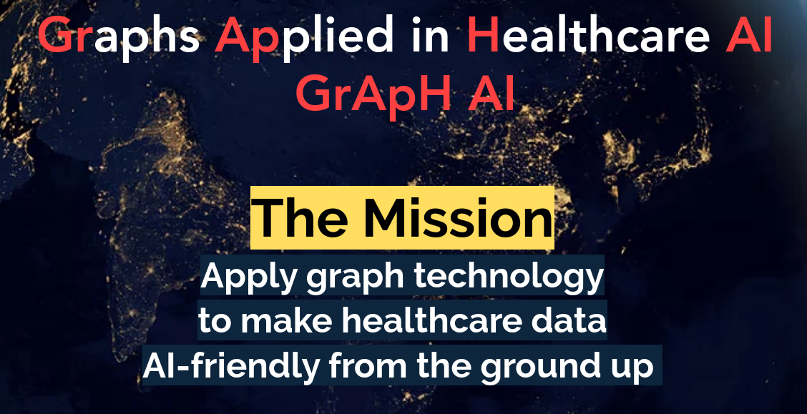

  

Table of Contents
1. [Introduction](#introduction)
2. [Getting Started](#getting-started)
3. [To-do list](#to-do)

***

## 1. Introduction
The emerging uses of artificial intelligence are transforming many industries, but the healthcare sector lags behind this progress partly because the production databases holding patient data are too poorly organized to run artificial intelligence algorithms online. Instead, research centers are creating isolated, curated databases to develop proof-of-concept algorithms. This work is daily producing impressive results that demonstrate the potential utility of artificial intelligence in healthcare, but these results rarely make it from the research database to be applied to the online databases that support day-to-day patient care. To address this problem, we have organized an open, sharing community of physicians, data scientists, data engineers, software engineers, students, and others inspired by a common vision: to make healthcare data AI-friendly from the ground up.

We are working use-case by use-case with real patient data to build a foundation of knowledge, a toolkit, and a corps of colleagues to act as a springboard for real-world implementations. In addition to use cases, we work to address global issues such as human-machine interfaces and knowledge graphing. 

We currently have a single shared [Neo4j](https://github.com/MIS-GrApH-AI/Public/wiki/Coding-standards-&-Conventions) database holding anonymized patient data and the early stages of a knowledge graph, hosted in San Diego, California. We communicate through Slack and regularly scheduled working group meetings. Our code is pushed to GitHub under the MIT license, which means we allow anyone to build upon our work even in proprietary, commercial products. We support those who want to go out and make things happen in the real world, and we would love to have you join us.

You can visit our [website](https://www.misociety.org/graph-working-group) or [wiki](https://github.com/MIS-GrApH-AI/Public/wiki) to learn more. If you are interested in joining the working group, please contact Tim McLerran at tmclerran@gmail.com or through [LinkedIn](https://www.linkedin.com/in/tim-mclerran/). 

***

## 2. Getting Started
The GrApH AI community has two repos:
- A [Credentialled_Access](https://github.com/MIS-GrApH-AI/Credentialed_Access) repo for any documents or code that interact with patient-level data. In order to access this repository, you must submit proof that you have completed the [credentialling process outlind by PhysioNet](https://mimic.mit.edu/docs/gettingstarted/). 
- A [Public](https://github.com/MIS-GrApH-AI/Public) repo for everything else.

More detailed documentation is being developed in our [Wiki](https://github.com/MIS-GrApH-AI/Public/wiki).

***

## 3. To-do list  
### Overall Mission:  
Apply graph technology to make the world's medical data AI-friendly from the ground up 
  
### Next Milestones:  
- Embed the world's medical knowledge into a knowledge graph
  - Develop a data model that maps RxNorm, MED-RT, and MeSH relationships onto a base of UMLS concepts
  - Import UMLS concepts into a graph
  - Import RxNorm relationships
  - Import MED-RT relationships
  - Import MeSH relationships
- Fulfill 1 or more use cases that become possible given the new knowledge graph
  
### Upcoming Milestones:  
- Scrape the world's medical literature for relationships among UMLS concepts
  - Find or create a set of human-verified subject-predicate-object triples for the sentences in SemMedDB
  - Create a deep learning model to extract subject-predicate-object triples from the sentences in SemMedDB
  - Apply the deep learning model to all of the sentences in SemMedDB and assess performance
  - Apply the deep learning model to all of the world's medical literature and assess performance
  - Import the subject-predicate-object triples from the deep learning model into the UMLS-based knowledge graph
- Fulfill 1 or more use cases that become possible given the enhanced knowledge graph
  
### Continuous contributions:  
- Identify the up-to-date world's best tools for any given task
- Share experiences of healthcare and health data from diverse locations around the world
- Organize a knowledge base for graphs 
